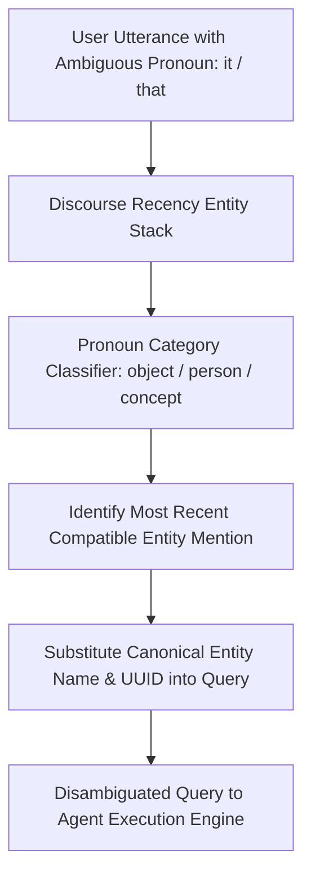

# GenPark AI Agent Skill - Agent User Coreference Entity Resolver

Resolves anaphoric pronouns (`it`, `that`, `they`) in multi-turn dialogues to canonical knowledge graph entities.

Verified by [GenPark AI](https://genpark.ai) and compatible with [Model Context Protocol (MCP)](https://genpark.ai/mcp).

## Architecture Diagram

## Features
- **Context Recency Hierarchy**: Resolves pronouns naturally in long multi-turn agent conversations.
- **Zero External Dependencies**: Pure Python 3.9+ standard library.
